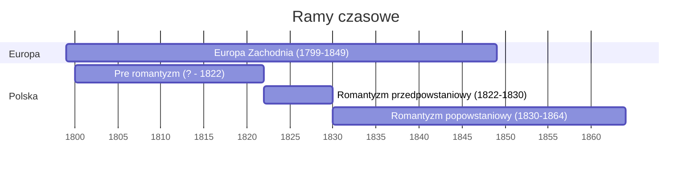

- 1799 - Koniec Rewolucji Francuskiej
- 1822 - Wydanie *Ballad i Romansów* przez A. Mickiewicza
- 1830 - Wybuch powstania listopadowego
- 1849 - Zakończenie Wiosny Ludów
- 1864 - Upadek powstania styczniowego

Romantyzm rozpoczął się w Anglii i Niemczech, gdzie było to stopniowe. Natomiast w Polsce[^1] i Francji było to nagłe i występowały spory pomiędzy klasykami i romantykami (na gołe klaty).

[^1]: Warto dodać że w tym momencie Polska straciła niepodległość, co skutkowało restrykcjami w publikowaniu Polskich książek (szczególnie po powstaniu listopadowym). Na przykład *Pan Tadeusz* został wydany w Paryżu, następnie był przemycany do Polski.

 Polski romantyzm można podzielić na 2 główne części:
- przedpowstaniowy - Warszawa, Wilno
- popowstaniowy - Paryż (represje po nieudanym powstaniu)

## Głowne Idee Romantyzmu

Romantyzm ma części wspólne z oświeceniem, ale wiele z nich odrzucił. Zapożyczył **indywidualizm**, ale odrzucił kult nauki i na jej miejsce wybrał **irracjonalizm** (wiara, instynkt, intuicja) oraz **mistycyzm** (kontakt z Bogiem bez kościoła).
Występowała też rekonstrukcja religii pra-słowiańskich oraz ceniono **ludowość** (folklor, obyczaje itp). 

### Słowniczek

- indywidualizm: Osobne podejscie
- irracjonalizm: Poznawanie przez instynkt, wiarę i intuicję
- metafizyka: Doświadczenie niemożliwe przez zmysły oraz rozum
- ludowość: Powrót do folkloru
- historyzm: Odkrywanie historii
- mistycyzm: Kontakt z Bogiem poza kościołem
- naród: Pojęcie narodu jako państwa

## Zdobycze romantyzmu

- Rozszerzenie się kultury na szerszą publiczność (głównie teatry i muzyka)
- Język staje się ujednolicony
- Kultura i obyczaje stają się unormowane (rezygnacja ze śmiesznych ubrań i higiena staję się normą)
- Połączenie osób przez przynależność narodową